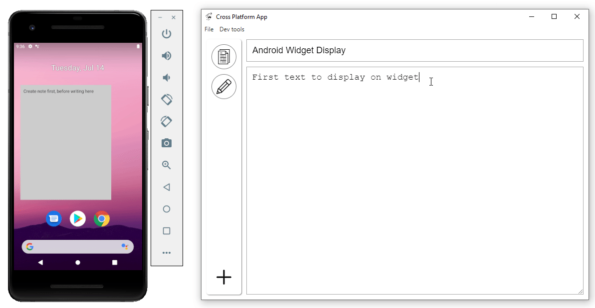

### About

This is a basic widget for Android that pulls an API. It's very simple, it took me almost 2 weeks to get this to work with a lot of help as I'm not an Android developer. You can see the gif below of what it does. This app is related to the [Cross Platform App](https://github.com/jdc-cunningham/cross-platform-app) I made. The data displayed on this widget is pulled on a local API shared by mobile/desktop applications, the API is hosted on a Raspberry Pi.

### more background
The basic part of this widget(ability to pin widget to home screen) came from this [YouTube tutorial](https://www.youtube.com/watch?v=xGQJg31TPtU). I then figured out how to call an API in Android, how to listen to the a "phone is on" event which then calls the API and then I had to figure out how to bridge everything together to update the widget. The actual activity(screen that opens up when you click on Widget) isn't touched as I haven't bothered to modify that. I have a mobile app(from the Cross Platform App with React Native).

I'll probably update this later on but yeah it was a struggle for me developing this.

### Bugs
- there is some error that appears, I saw it in Logcat, it's about unregistering the `registerReceiver` I think. It does not seem detrimental but something to be aware of, this is not intended to be released for wide audience. I had to build the APK/transfer it to the phone/install it against all the warnings.

Specifically it says `Activity com.example.tutorialwidget.MainActivity has leaked IntentReceiver`
